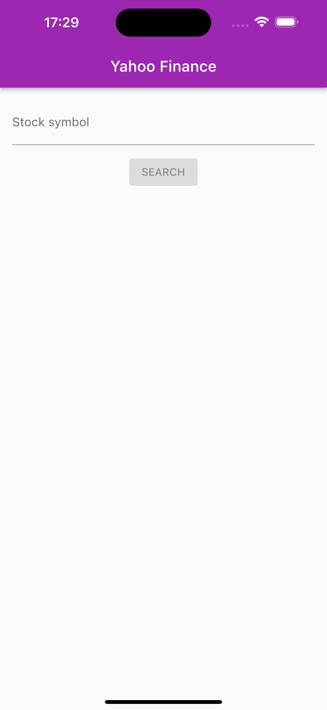
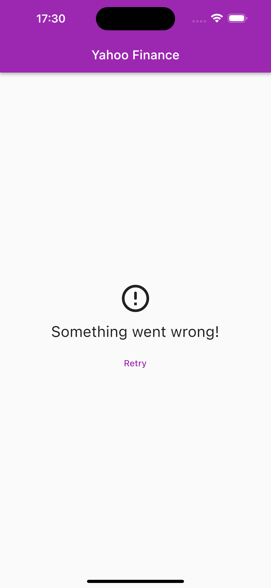
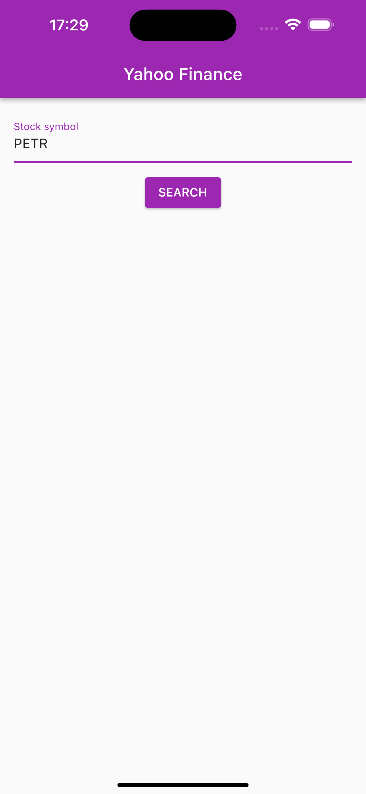
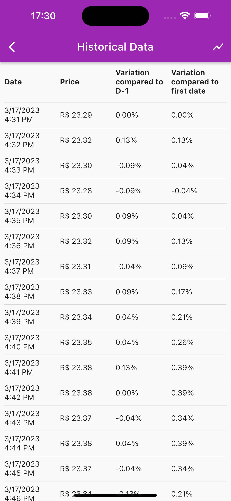
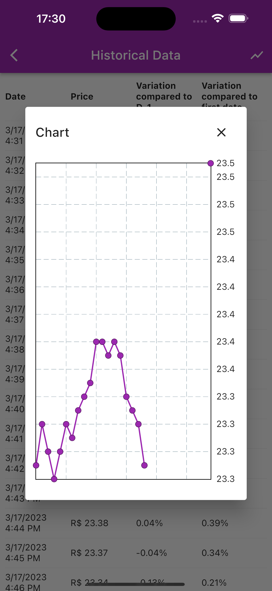

# Flutter Challenge - Yahoo Finance API

This challenge consists of presenting the change in the price of an asset of your choice in the 
last 30 trading sessions. The app must present the percentage of change in price from one day to 
the  next, the percentage since the first trading session presented and a chart with the result of
the change.

Challenge developed by Jonny Eduardo Banach on March 19th 2023.

### Applied concepts

- BLoC pattern;
- ListView;
- Chart (fl_chart);
- API calls;
- Error handling;
- Loading states;
- Unit testing;

### Building and running the app

1. Clone the repository on your computer.
2. Connect a smartphone to the computer or start a simulator/ADV (Android Virtual Device).
3. Go to the project's root folder in the terminal and enter these commands:  `flutter build apk` and `flutter install`.
4. Open the "Yahoo Finance" application.

### Running the tests

1. Clone the repository on your computer.
2. Go to the project's root folder in the terminal and enter this command: `flutter test test/unit_test/get_stock_indicators.dart`.

### Screenshots

| Description            | Image                                           |
|------------------------|-------------------------------------------------|
| Search Screen (empty)  |   |
| Error Message          |   |
| Search Screen (filled) |  |
| Historical Data Screen |    | 
| Chart                  |   |
